<h1 align="center">HudAI | هُداي</h1>

  <b>Intelligent Islamic Knowledge System powered by RAG, LLMs, and emotion-aware spiritual support.</b>

  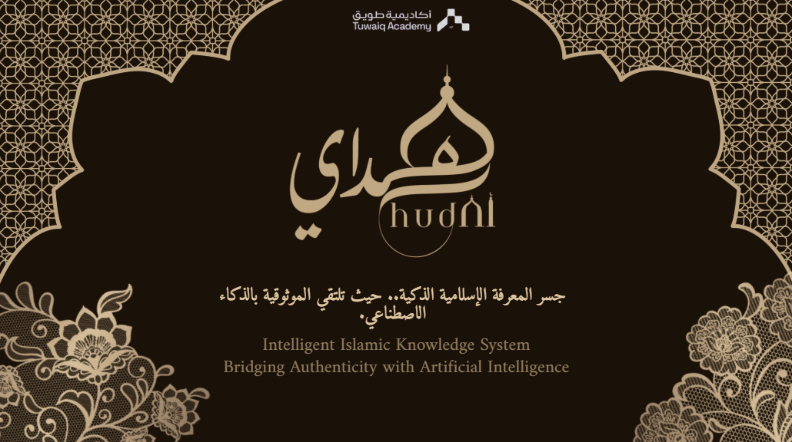

  A results showcase for <b>HudAI</b>, an intelligent Islamic QA system designed to provide source-grounded Islamic answers, Quranic Tafsir, Hadith support, and faith-based emotional guidance.

> **Note:** This repository is only for showcasing the project results, screenshots, demo, architecture, and evaluation examples.  
> The original source code is private due to team ownership.

---

## Overview

**HudAI | هُداي** is an intelligent Arabic Islamic question-answering system designed to provide reliable, source-grounded responses for Islamic knowledge.

The system supports questions related to:

- Quranic Tafsir
- Hadith search and verification
- Islamic rulings
- Faith-based emotional support
- General Islamic guidance within the project scope

HudAI uses a RAG-based architecture to retrieve information from trusted Islamic sources before generating the final answer, reducing hallucination and improving answer reliability.

---

## Team Members

- Leen Almufleh  
- Raghad Dasman  
- Mansour Alhenaki  
- Yasir Aladwani  

---

## Project Problem

Many users face difficulty accessing reliable Islamic knowledge online. Information related to Quranic Tafsir, Hadith, and Islamic rulings is often scattered across different platforms, and general-purpose AI chatbots may generate answers without trusted religious grounding.

HudAI addresses this issue by combining trusted Islamic sources with a conversational AI experience that is simple, Arabic-focused, and user-friendly.

---

## Key Features

- Source-grounded Islamic question answering
- Quranic Tafsir support
- Hadith verification and retrieval
- Islamic rulings support
- Faith-based emotional and spiritual support
- Arabic-first user experience
- Text and voice interaction
- Clean Flutter-based interface
- Admin-side screens for reports and consultations
- Evaluation examples and demo results

---

## System Architecture

HudAI follows a modular pipeline that starts with user input, then Arabic text normalization, query routing, retrieval from trusted sources, post-processing, and final answer generation.

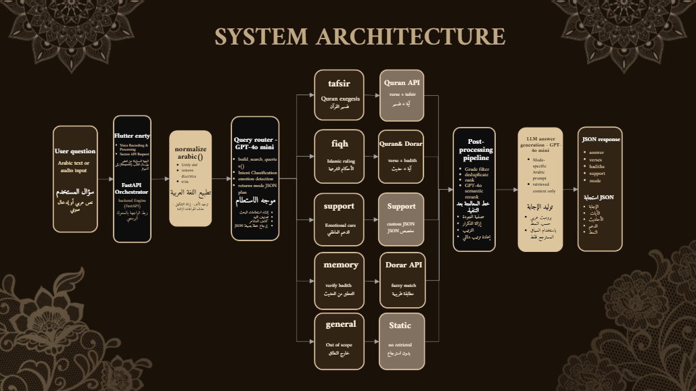

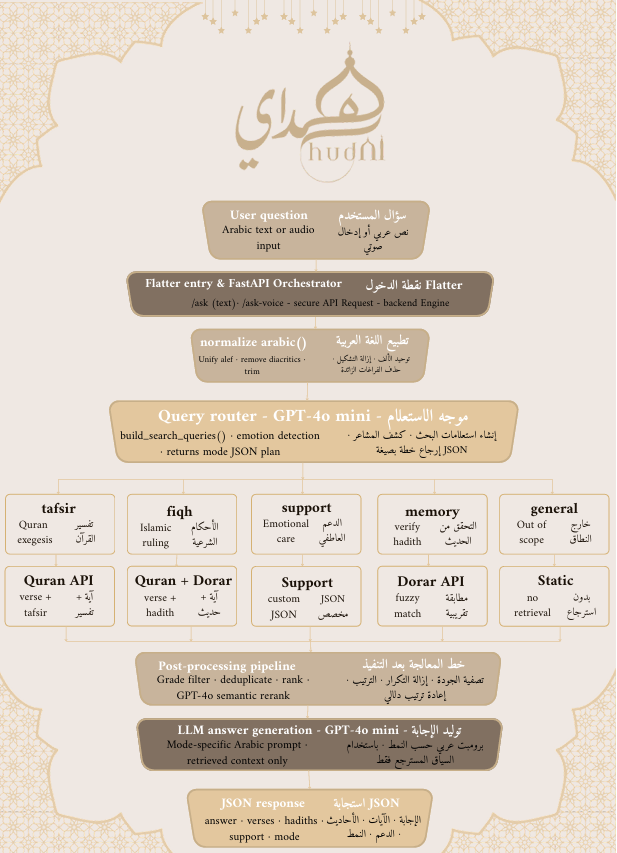

---

## AI Pipeline

1. The user submits a question through the Flutter application.
2. The system receives the request through the backend API.
3. Arabic text is normalized to improve retrieval quality.
4. The query router classifies the question into the correct mode.
5. Relevant information is retrieved from trusted Islamic sources.
6. Retrieved content is filtered, ranked, and processed.
7. The LLM generates a grounded Arabic response.
8. The frontend displays the answer, related verses, hadiths, or support content.

---

## Supported Modes

| Mode | Purpose |
|---|---|
| Tafsir | Explains Quranic verses using Tafsir sources |
| Fiqh | Answers Islamic ruling-related questions |
| Hadith | Retrieves and verifies Hadith content |
| Support | Provides emotional and spiritual support |
| General | Handles general Islamic guidance within scope |
| Out of Scope | Politely redirects unsupported questions |

---

## Tech Stack

### AI & Backend
- Python
- FastAPI
- OpenAI API
- GPT-4o mini
- Retrieval-Augmented Generation
- RAGAS
- DeepEval
- BeautifulSoup4
- Requests

### Frontend
- Flutter
- Dart
- HTTP Client
- JSON Parsing
- Responsive UI

### Cloud & Deployment
- Firebase Authentication
- Cloud Firestore
- Railway
- Docker
- Nginx

### Data Sources
- Quran.com API
- Dorar.net API
- Custom Emotional Support Dataset

---

## Demo Video

Watch the project demo:

[Watch HudAI Demo](https://drive.google.com/file/d/14Jz1pRg3hq7EgNe7uqWHf8k8Cz4Yzc3f/view?usp=sharing)

---

## Application Screenshots

### Login Screen
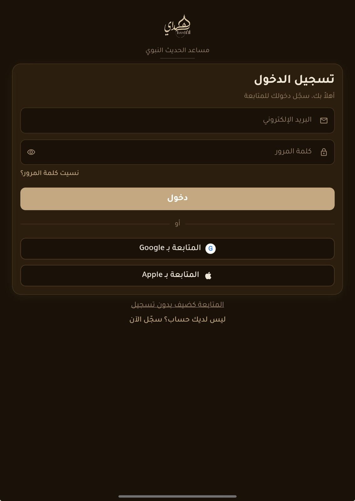

### Sign Up Screen
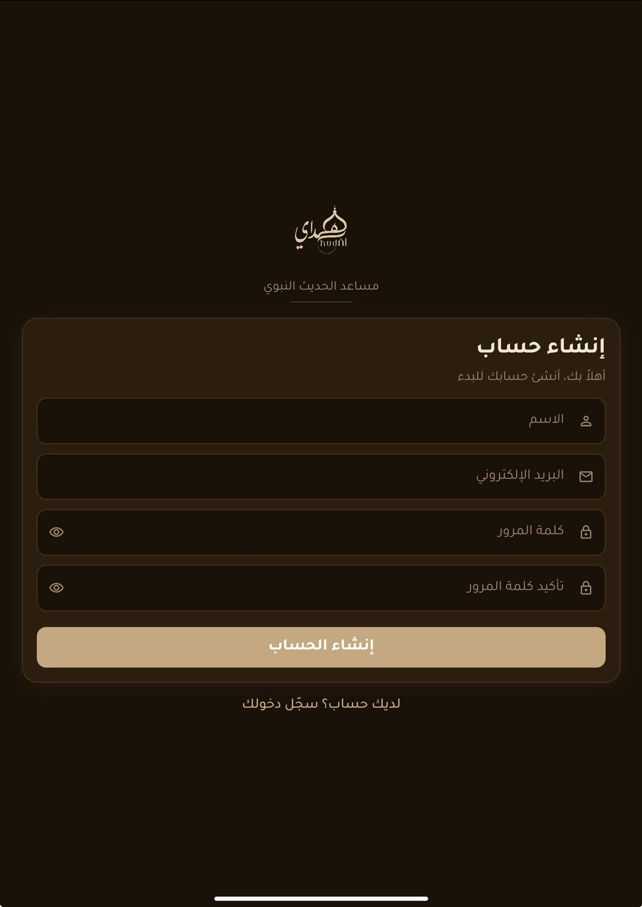

### Verification Code Screen
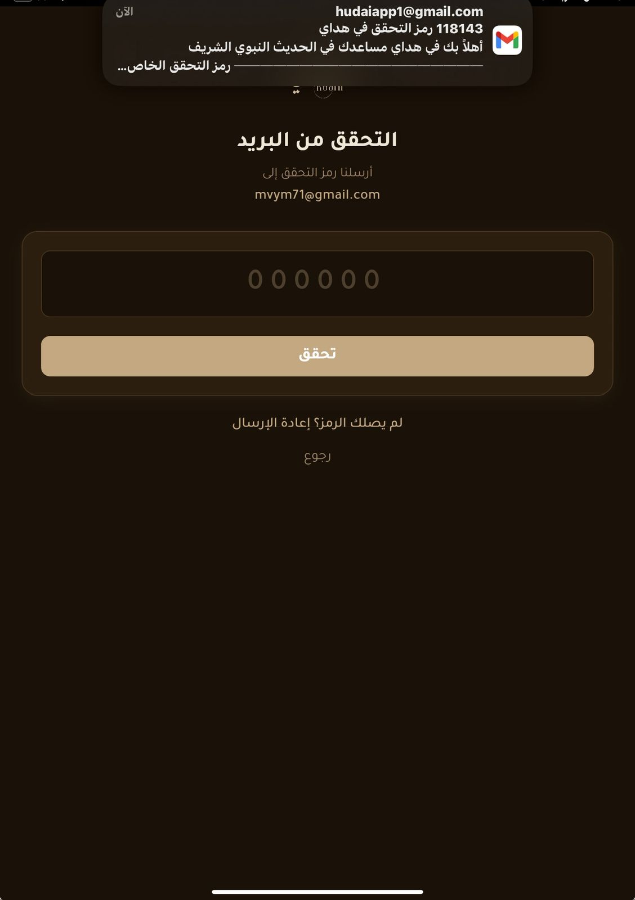

### Home Screen
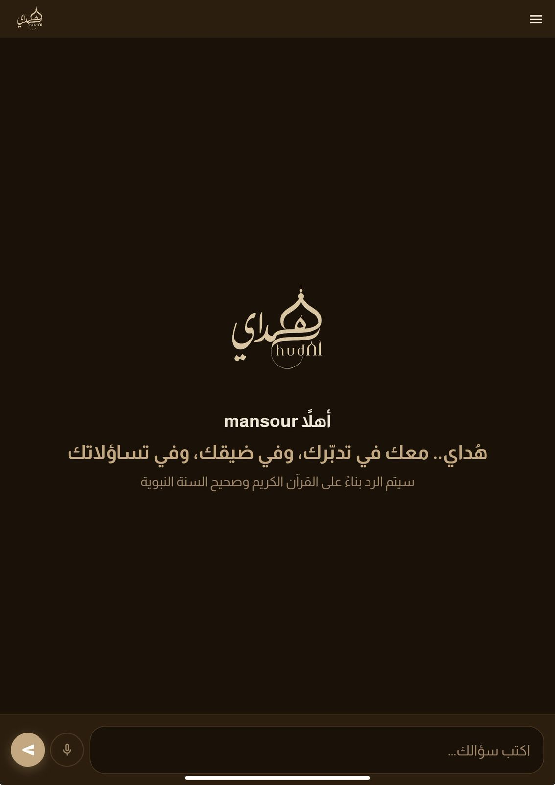

### Chat Interface
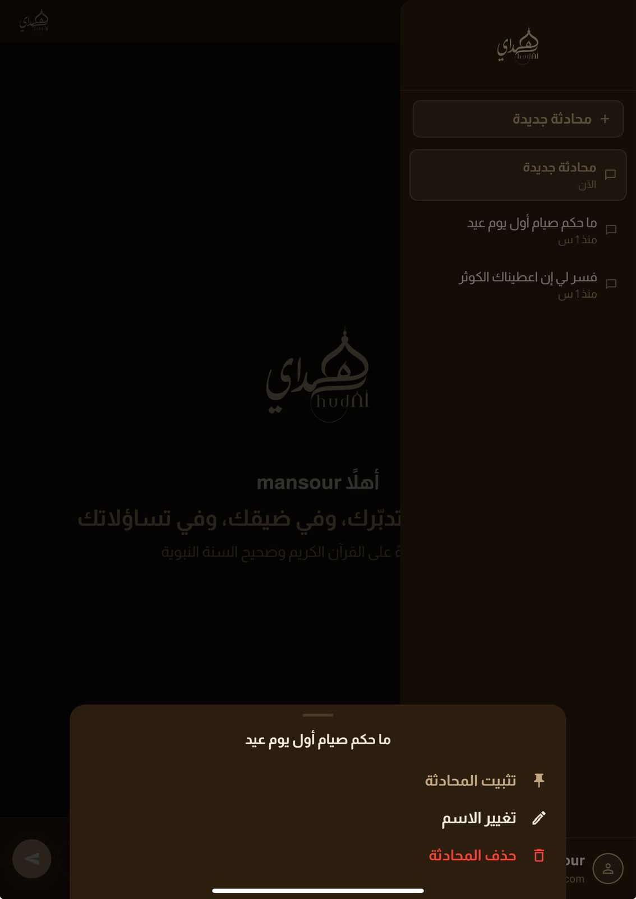

### Settings Screen
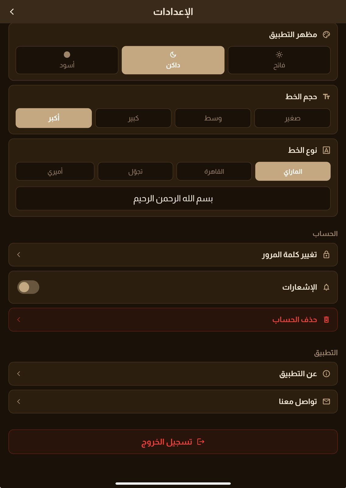

### Light Mode
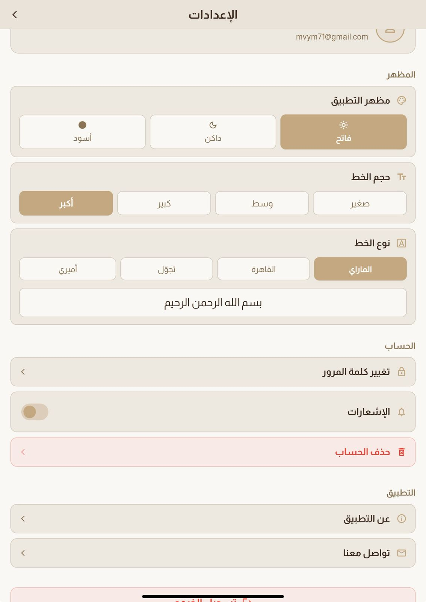

### About HudAI
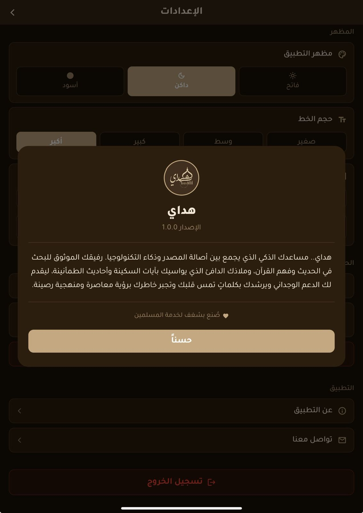

### Admin Interface
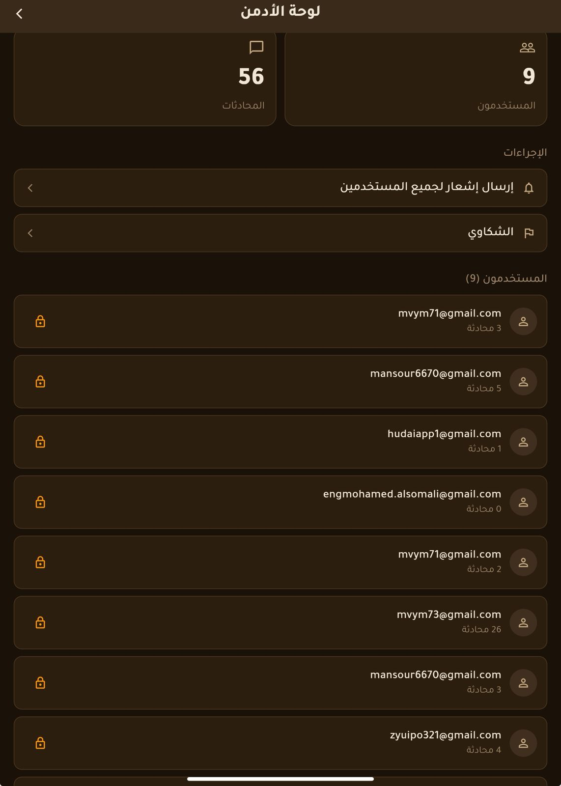

### Admin-Only Complaints Screen

---

## Example Responses

### Tafsir Example
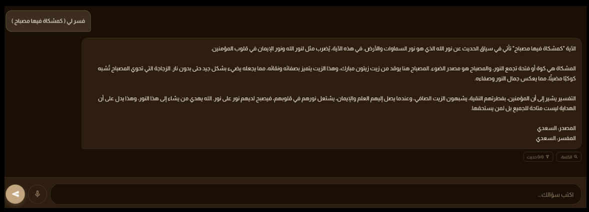

### Hadith Example
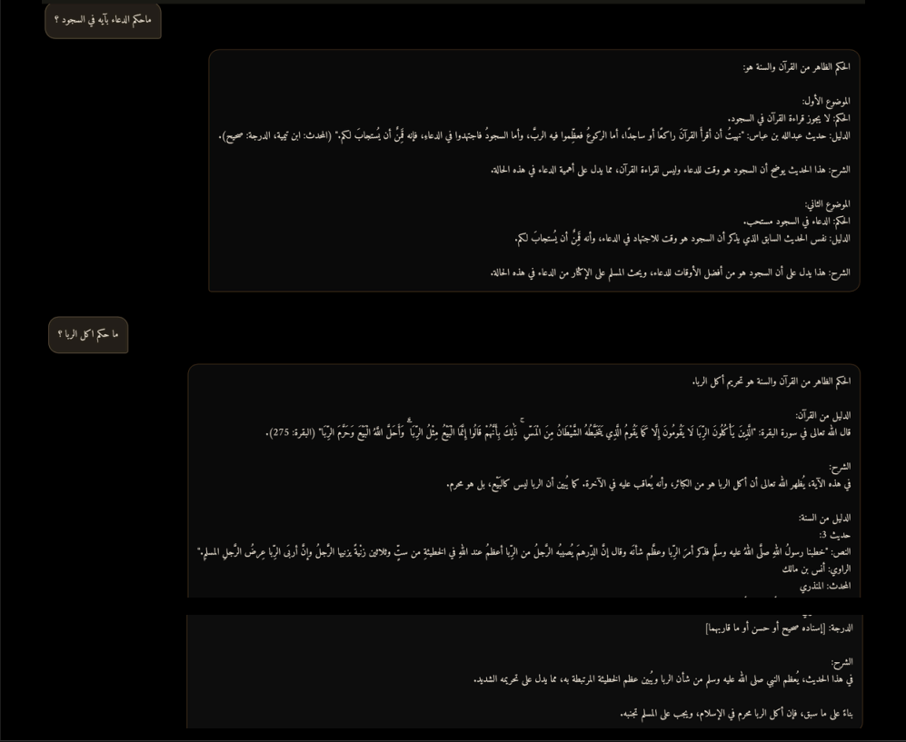

### Hadith Verification Example
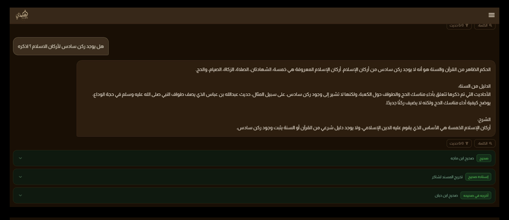

### Fiqh Example
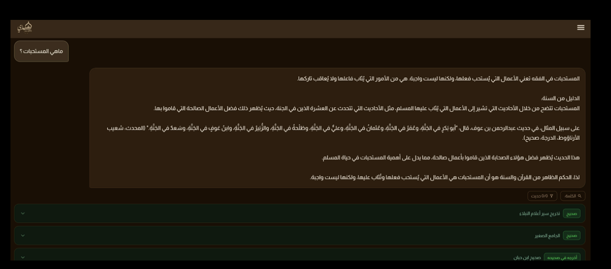

### Emotional Support Example
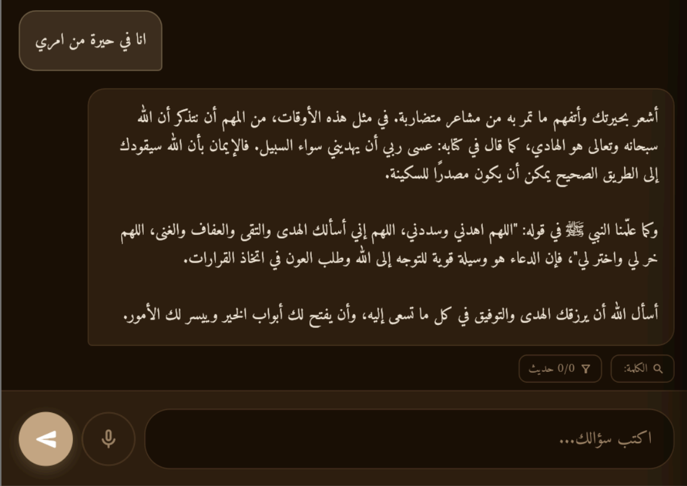

### Out-of-Scope Example

---

## Evaluation Summary

HudAI was evaluated using RAG-based evaluation methods to measure answer relevance, faithfulness, and source-grounding quality.

| Metric | Score |
|---|---|
| Answer Relevancy | 0.91 / 1.00 |
| Faithfulness | 0.62 / 1.00 |
| Source Attribution Accuracy | 100% |
| Total Test Cases | 17 |

---

## Additional Examples

A PDF file containing additional system response examples is available here:

[View HudAI Examples PDF](docs/HudAI_Examples.pdf)

---

## Repository Purpose

This repository is intended to showcase:

- Project idea
- System architecture
- Demo results
- UI screenshots
- Example responses
- Evaluation summary

It does not include the original source code.

---

## Disclaimer

HudAI is an educational AI project developed as a capstone project.  
It provides source-grounded Islamic information but does not replace qualified scholars, official fatwa authorities, or certified Islamic institutions.
